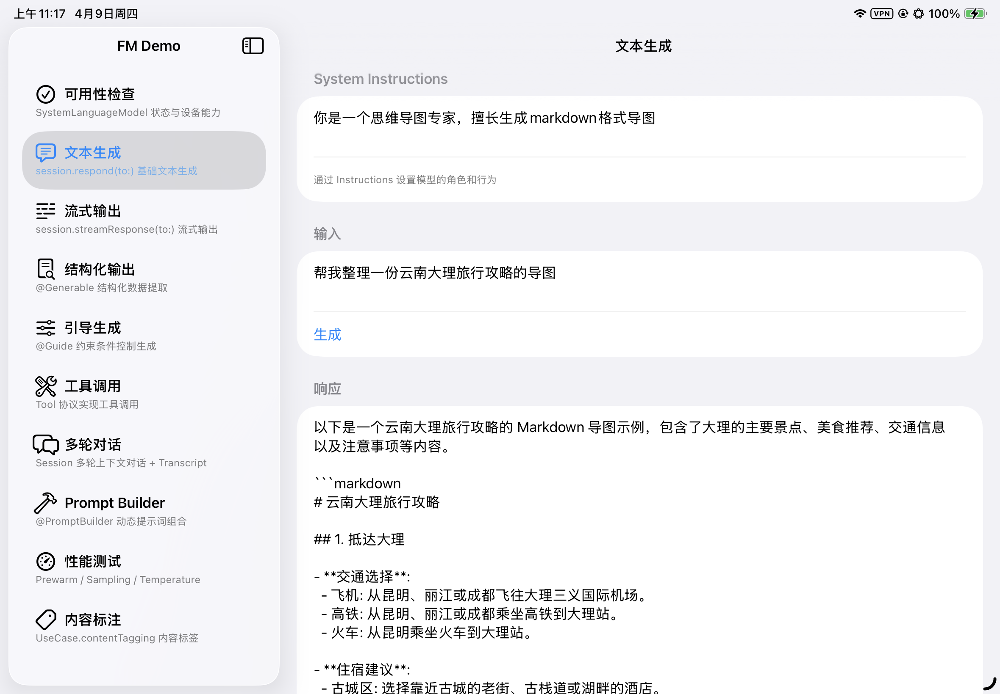
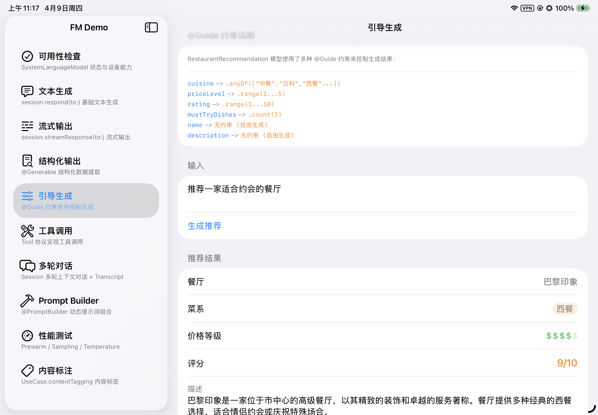
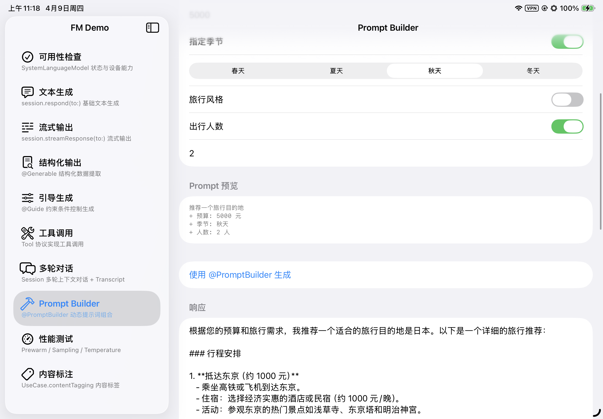

# Foundation Models Demo

Apple Foundation Models 框架全能力演示 App，覆盖 iOS 26 / iPadOS 26 上的端侧大模型 API。

> **运行要求：** Xcode 26+，真机需启用 Apple Intelligence。模拟器可编译但无法调用模型。

## 截图预览

### 可用性检查

检查 `SystemLanguageModel` 状态：模型是否可用、上下文窗口大小 (4,096 tokens)、支持语言列表，以及 Token 计数工具。


### 文本生成

通过 `LanguageModelSession` + `Instructions` 设置系统角色，调用 `session.respond(to:)` 生成文本。示例中以"思维导图专家"角色生成了云南大理旅行攻略的 Markdown 导图。



### 结构化输出

使用 `@Generable` 宏定义 Swift 结构体，模型直接输出类型安全的结构化数据。示例将一段电影评论自动提取为标题、星级评分、情感倾向、主题标签和摘要。


### 引导生成

通过 `@Guide` 宏为结构体属性添加约束（`.anyOf`、`.range`、`.count`），控制模型生成范围。示例中餐厅推荐的菜系、价格等级、评分、必点菜品数量均受约束。



### 工具调用

实现 `Tool` 协议，模型自动识别意图并调用对应工具。示例中同时查询了东京和上海的天气，模型分两次调用 `getWeather` 工具后整合回答。


### Prompt Builder

使用 `@PromptBuilder` result builder 动态组合提示词。通过 UI 开关控制预算、季节、人数等条件，实时预览生成的 Prompt 并获取响应。



## 功能列表

| # | 功能 | 核心 API | 文件 |
|---|------|----------|------|
| 1 | 可用性检查 | `SystemLanguageModel.default`, `.availability`, `.tokenCount(for:)` | `AvailabilityView.swift` |
| 2 | 文本生成 | `LanguageModelSession`, `session.respond(to:)` | `TextGenerationView.swift` |
| 3 | 流式输出 | `session.streamResponse(to:)`, `AsyncSequence` | `StreamingView.swift` |
| 4 | 结构化输出 | `@Generable`, `session.respond(to:generating:)` | `StructuredOutputView.swift` |
| 5 | 引导生成 | `@Guide(.range, .anyOf, .count)` | `GuidedGenerationView.swift` |
| 6 | 工具调用 | `Tool` 协议, `Transcript` | `ToolCallingView.swift` |
| 7 | 多轮对话 | Session 上下文保持, `Transcript` 查看 | `MultiTurnChatView.swift` |
| 8 | 动态提示词 | `@PromptBuilder` 条件组合 | `PromptBuilderView.swift` |
| 9 | 性能测试 | `session.prewarm()`, `GenerationOptions` | `PerformanceView.swift` |
| 10 | 内容标注 | `SystemLanguageModel(useCase: .contentTagging)` | `ContentTaggingView.swift` |

## 项目结构

```
FMTest/
├── FMTestApp.swift                 # App 入口
├── ContentView.swift               # NavigationSplitView 主导航
│
├── Models/                         # @Generable 数据模型
│   ├── MovieReview.swift           #   电影评论分析
│   ├── ContactInfo.swift           #   联系人信息提取
│   ├── ContentTags.swift           #   内容标签 (emotion/category/keywords)
│   └── RestaurantRecommendation.swift  #   餐厅推荐 (多种 @Guide 约束)
│
├── Tools/                          # Tool 协议实现
│   ├── WeatherTool.swift           #   天气查询 (模拟数据)
│   └── CalculatorTool.swift        #   四则运算
│
├── Components/                     # 可复用 UI 组件
│   └── FlowLayout.swift           #   自动换行流式布局
│
└── Views/                          # 各功能演示页面
    ├── AvailabilityView.swift
    ├── TextGenerationView.swift
    ├── StreamingView.swift
    ├── StructuredOutputView.swift
    ├── GuidedGenerationView.swift
    ├── ToolCallingView.swift
    ├── MultiTurnChatView.swift
    ├── PromptBuilderView.swift
    ├── PerformanceView.swift
    └── ContentTaggingView.swift
```

## 快速开始

1. 使用 Xcode 26+ 打开 `FMTest.xcodeproj`
2. 选择真机目标设备 (需支持 Apple Intelligence)
3. Build & Run
4. 从左侧导航栏选择功能进行测试

## 关键概念速查

### @Generable — 结构化输出

```swift
@Generable(description: "电影评论分析")
struct MovieReview {
    @Guide(description: "评分", .range(1...5))
    var rating: Int

    @Guide(description: "情感", .anyOf(["positive", "negative", "neutral"]))
    var sentiment: String
}

let response = try await session.respond(to: text, generating: MovieReview.self)
let review = response.content  // MovieReview 实例
```

### Tool — 工具调用

```swift
struct WeatherTool: Tool {
    let name = "getWeather"
    let description = "查询城市天气"

    @Generable struct Arguments {
        @Guide(description: "城市名") var city: String
    }

    func call(arguments: Arguments) async throws -> String {
        return fetchWeather(for: arguments.city)
    }
}

let session = LanguageModelSession(tools: [WeatherTool()])
```

### @PromptBuilder — 动态提示词

```swift
let response = try await session.respond {
    "推荐旅行目的地"
    if hasBudget { "预算 \(budget) 元" }
    if hasSeason { "季节: \(season)" }
}
```

## 参考资料

- [Apple Foundation Models Documentation](https://developer.apple.com/documentation/FoundationModels)
